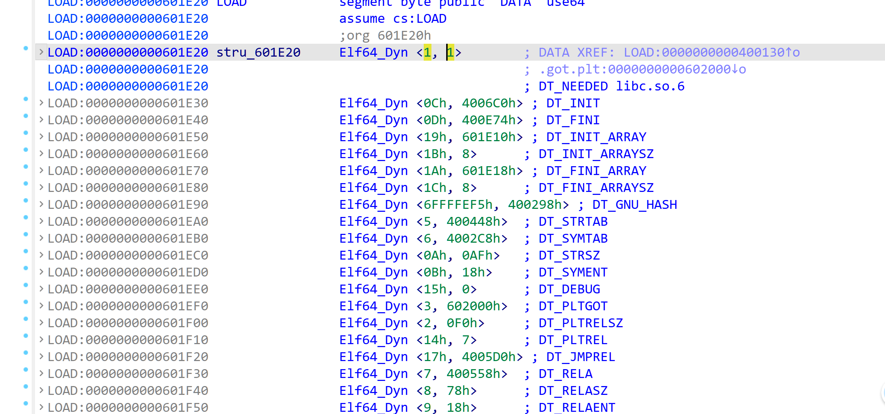
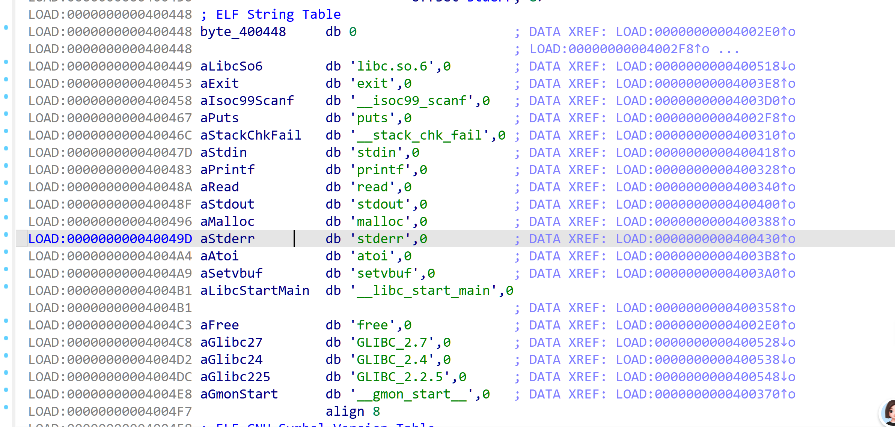
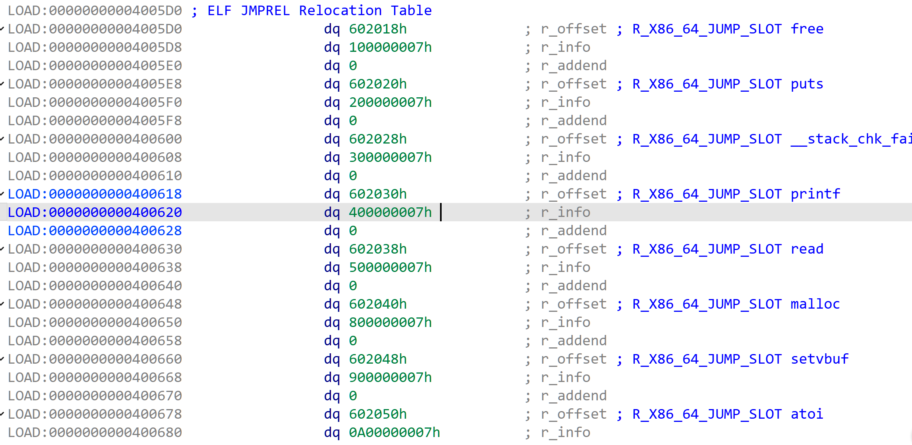
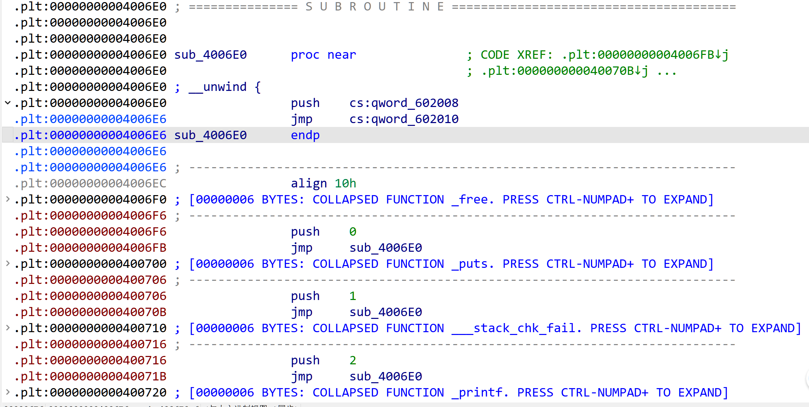
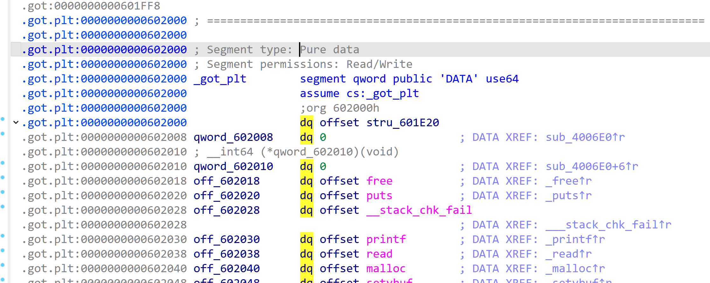

## ret2dlresolve

核心就是动态链接的过程,可以说过程非常复杂,涉及到大量结构体和大量glibc源码,在说明一下流程前先需要知道一些基础:

1. 本身ELF文件运行,一定需要链接一个libc和ld,libc存放这些函数的源码机器码,ld负责调控整个ELF文件和各个文件的联系

2. 只有首次调用某个库函数时,才会把真正的libc地址写进got.plt(就是为了效率)

3. ELF有`.plt段`  `.got.plt段` `.got段`  (在理解这一段时,可以结合下面最近的前3个图理解)

   1. got通常用来存储外部的全局变量,用的很少

   2. plt是函数调用时必须经过的一段跳板汇编指令,他是动态链接的开始

   3. .got.plt是存放libc真实地址的地方 该段的前3行的变量具有特殊意义

   ```
   GOT[0]    .dynamic节的起始地址
   GOT[1]    link_map(该链接库的链表结构体)
   GOT[2]    resolver地址(_dl_runtime_resolve函数,核心链接函数)
   ```

   ### .dynamic

   `.dynamic` 就是一份ELF模块自己携带的“动态链接说明书”,就是告诉链接器,我的一些结构在哪里存放

   它通常是Elf64_Dyn结构体组成

   ```
   typedef struct {
       Elf64_Sxword d_tag;   // 这一项是什么类型,或者是这一项的名字,就是下面DT_开头的那些，这些都是宏，有唯一对应的数字
       union {               //union为共用体,里面只有一个实际占用了这块内存
           Elf64_Xword d_val; // 一个数值 32位4字节,64位8字节
           Elf64_Addr  d_ptr; // 一个地址 32位4字节,64位8字节
       } d_un;
   } Elf64_Dyn; 一个大小为0x10
   ```

   例如主程序可能会有自己的.dynamic

   ```
   DT_NEEDED   -> "libc.so.6"  #我需要libc
   DT_STRTAB   -> .dynstr		#我的.dynstr段地址
   DT_SYMTAB   -> .dynsym		#我的.dynsym地址
   DT_JMPREL   -> .rela.plt	#我的rela.plt段地址
   DT_PLTGOT   -> .got.plt		#我的.got.plt地址
   ...
   ```

   

   这里出现了3个新名字 `.dynstr` `.dynsym` `.rela.plt`  这是链接过程的核心3个节(表) (后续真正的链接过程和介绍顺序刚好相反)

   1. **.dynstr--DT_STRTAB--0x400448--ELF_String_Table(字符串表)**

   

   这里存储的就是每个字符串名称的ascll码,其中ida会自动在前面加一个a表示这里存放的是ascll码,每个名称实际上都以\x00结尾

   2. **.dynsym--DT_SYMTAB--0x4002bc--ELF Symbol Table(动态符号表)**

      每个元素都是自定义的Elf64_Sym类型,其中重点是第一个变量st_name,其余的不在说明

   ```
   typedef struct {
       Elf64_Word st_name;    //存放的.dynstr段的各个函数到段头的偏移,比如上图对于printf函数就是0x400483-0x400448
       unsigned char st_info; //0x12 = STB_GLOBAL | STT_FUNC，全局函数符号
       unsigned char st_other;//这一项恒为0
       Elf64_Section st_shndx;
       Elf64_Addr st_value;    // 函数的libc偏移
       Elf64_Xword st_size;
   } Elf64_Sym;
   ```

   	

   3. **.rela.plt--DT_JMPREL--0x4005d0h--ELF JMPREL Relocation Table(跳转重定位表)**

      每一项明显都是同一个数据结构,这也是一个结构体数组,**这个数组的下标有特殊用处**

   ```
   typedef struct
   {
   	Elf64_Addr	r_offset; //函数的.got.plt地址,后续拿到libc会写到这个变量存储的地方
   	Elf64_Word	r_info;
   	Elf64_Sword	r_addend; 
   } Elf64_Rela; 大小为0x18
   ```

   	r_info实际上由2部分构成,例如0x100000007  1代表**dynsym 索引**(symbol_index)   7代表重定位类型编号(字面意思,比如外部全	局变量重定位就用6表示)

   

   到这里你可能有点乱,没关系,下面讲解动态链接的过程时,就会依次用到这些表你就能串起来了

   ### Link_map

   link_map是一个链表结构体,他用于记录各种链接的库或者模块的基本信息

   ```
   struct link_map {
       Elf64_Addr l_addr;   #该模块加载进来的base地址(就像libc地址)
       char *l_name;		 #模块的名字
       Elf64_Dyn *l_ld;	 #该模块的.dynamic起始地址
   	Elf64_Dyn *l_info[]  #结构体指针组成的数组，下标是DT_的那些宏对应的数字
   	...
       struct link_map *l_next;	#链表的下一个节点
       struct link_map *l_prev;	#链表的前一个节点
       ...
   };
   ```

     这个l_info[]举个例子，比如源码看到`l_info[DT_SYMTAB]` 这个数组存储的就是.dynamic中的DT_SYMTAB的地址(上面图的0x601eb0),这实际上就是相当于我们把这个.dynamic这块内存做成数组,当我们需要访问时,直接通过l_info[]即可访问,不需要通过l_ld获取到首地址后再遍历去找

### 链接流程分析: 

当首次调用某个libc函数时,例如`call printf`  首先程序会先跳转到对应函数的.plt地址,即下方的那些`push 0 jmp` `push 1 jmp` 这个数字0 1 2,我们叫做**reloc_index**或者**reloc_arg**,这个数字很重要



很容易发现所有的jmp都指向0x4006e0 ,我们称这2行为plt0

```
push    cs:qword_602008
jmp     cs:qword_602010
```

push的地址就是下图.got.plt第二行link_map的位置,然后jmp到0x602010,正好就是该段的第三行,相当于我们拿到了link_map参数,和一个reloc_index 然后进了这个核心的链接函数(由于我们的ida都是静态编译,所以看不到链接函数的地址)



该函数总体可以总结为  **参数转换 + 保存现场 + 调 `_dl_fixup` + 恢复现场 + 跳到目标函数。**

其中前两步相当于保护一下是一个准备工作,这部分涉及到很多栈操作,非常复杂,我们不细说

**_dl_fixup函数**(glibc完整源码,dl-runtime.c 第59行)

```
DL_FIXUP_VALUE_TYPE
attribute_hidden __attribute ((noinline)) ARCH_FIXUP_ATTRIBUTE
_dl_fixup (
# ifdef ELF_MACHINE_RUNTIME_FIXUP_ARGS
	   ELF_MACHINE_RUNTIME_FIXUP_ARGS,
# endif
	   struct link_map *l, ElfW(Word) reloc_arg)  // l是指针
{
  const ElfW(Sym) *const symtab
    = (const void *) D_PTR (l, l_info[DT_SYMTAB]);
  const char *strtab = (const void *) D_PTR (l, l_info[DT_STRTAB]);

  const PLTREL *const reloc
    = (const void *) (D_PTR (l, l_info[DT_JMPREL]) + reloc_offset);
  const ElfW(Sym) *sym = &symtab[ELFW(R_SYM) (reloc->r_info)];
  const ElfW(Sym) *refsym = sym;
  void *const rel_addr = (void *)(l->l_addr + reloc->r_offset);
  lookup_t result;
  DL_FIXUP_VALUE_TYPE value;
  /* Sanity check that we're really looking at a PLT relocation.  */
  assert (ELFW(R_TYPE)(reloc->r_info) == ELF_MACHINE_JMP_SLOT);

   /* Look up the target symbol.  If the normal lookup rules are not
      used don't look in the global scope.  */
  if (__builtin_expect (ELFW(ST_VISIBILITY) (sym->st_other), 0) == 0)
    {
      const struct r_found_version *version = NULL;

      if (l->l_info[VERSYMIDX (DT_VERSYM)] != NULL)
	{
	  const ElfW(Half) *vernum =
	    (const void *) D_PTR (l, l_info[VERSYMIDX (DT_VERSYM)]);
	  ElfW(Half) ndx = vernum[ELFW(R_SYM) (reloc->r_info)] & 0x7fff;
	  version = &l->l_versions[ndx];
	  if (version->hash == 0)
	    version = NULL;
	}

      /* We need to keep the scope around so do some locking.  This is
	 not necessary for objects which cannot be unloaded or when
	 we are not using any threads (yet).  */
      int flags = DL_LOOKUP_ADD_DEPENDENCY;
      if (!RTLD_SINGLE_THREAD_P)
	{
	  THREAD_GSCOPE_SET_FLAG ();
	  flags |= DL_LOOKUP_GSCOPE_LOCK;
	}

#ifdef RTLD_ENABLE_FOREIGN_CALL
      RTLD_ENABLE_FOREIGN_CALL;
#endif

      result = _dl_lookup_symbol_x (strtab + sym->st_name, l, &sym, l->l_scope,
				    version, ELF_RTYPE_CLASS_PLT, flags, NULL);

      /* We are done with the global scope.  */
      if (!RTLD_SINGLE_THREAD_P)
	THREAD_GSCOPE_RESET_FLAG ();

#ifdef RTLD_FINALIZE_FOREIGN_CALL
      RTLD_FINALIZE_FOREIGN_CALL;
#endif

      /* Currently result contains the base load address (or link map)
	 of the object that defines sym.  Now add in the symbol
	 offset.  */
      value = DL_FIXUP_MAKE_VALUE (result,
				   SYMBOL_ADDRESS (result, sym, false));
    }
  else
    {
      /* We already found the symbol.  The module (and therefore its load
	 address) is also known.  */
      value = DL_FIXUP_MAKE_VALUE (l, SYMBOL_ADDRESS (l, sym, true));
      result = l;
    }

  /* And now perhaps the relocation addend.  */
  value = elf_machine_plt_value (l, reloc, value);

  if (sym != NULL
      && __builtin_expect (ELFW(ST_TYPE) (sym->st_info) == STT_GNU_IFUNC, 0))
    value = elf_ifunc_invoke (DL_FIXUP_VALUE_ADDR (value));

  /* Finally, fix up the plt itself.  */
  if (__glibc_unlikely (GLRO(dl_bind_not)))
    return value;

  return elf_machine_fixup_plt (l, result, refsym, sym, reloc, rel_addr, value);
}
```

#### 第一部分

```
const ElfW(Sym) *const symtab
    = (const void *) D_PTR (l, l_info[DT_SYMTAB]);
  const char *strtab = (const void *) D_PTR (l, l_info[DT_STRTAB]);

  const PLTREL *const reloc
    = (const void *) (D_PTR (l, l_info[DT_JMPREL]) + reloc_offset);
  const ElfW(Sym) *sym = &symtab[ELFW(R_SYM) (reloc->r_info)];
  const ElfW(Sym) *refsym = sym;
  void *const rel_addr = (void *)(l->l_addr + reloc->r_offset);
```

注意`l`是我们传进来的那个link_map的指针,`reloc_arg`是我们在plt表push的那个数字

D_PTR函数不单独说了,函数逻辑就是返回`l->l_info[]`的值,就是.dynstr和.dynsym的首地址

第三个reloc就是函数在.rela_plt的地址里面的reloc_offset就是reloc_arg*0x18(实际上就是Elf64_Rela结构体大小) 可以回头看一下当时的图

然后取r_info的dynsym 索引,就拿到对应函数在dynsym的地址(之前提到过 r_info 高8位是索引,低8位是重定向类型)

最后的rel_addr实际上就是这个函数的plt.got地址

#### 第二部分

    assert (ELFW(R_TYPE)(reloc->r_info) == ELF_MACHINE_JMP_SLOT);
     if (__builtin_expect (ELFW(ST_VISIBILITY) (sym->st_other), 0) == 0)
        {
          const struct r_found_version *version = NULL;
    
          if (l->l_info[VERSYMIDX (DT_VERSYM)] != NULL)
    	{
    	  const ElfW(Half) *vernum =
    	    (const void *) D_PTR (l, l_info[VERSYMIDX (DT_VERSYM)]);
    	  ElfW(Half) ndx = vernum[ELFW(R_SYM) (reloc->r_info)] & 0x7fff;
    	  version = &l->l_versions[ndx];
    	  if (version->hash == 0)
    	    version = NULL;
    	}
    
          /* We need to keep the scope around so do some locking.  This is
    	 not necessary for objects which cannot be unloaded or when
    	 we are not using any threads (yet).  */
          int flags = DL_LOOKUP_ADD_DEPENDENCY;
          if (!RTLD_SINGLE_THREAD_P)
    	{
    	  THREAD_GSCOPE_SET_FLAG ();
    	  flags |= DL_LOOKUP_GSCOPE_LOCK;
    	}
    
    #ifdef RTLD_ENABLE_FOREIGN_CALL
          RTLD_ENABLE_FOREIGN_CALL;
    #endif
    
          result = _dl_lookup_symbol_x (strtab + sym->st_name, l, &sym, l->l_scope,
    				    version, ELF_RTYPE_CLASS_PLT, flags, NULL);
    
          /* We are done with the global scope.  */
          if (!RTLD_SINGLE_THREAD_P)
    	THREAD_GSCOPE_RESET_FLAG ();
    
    #ifdef RTLD_FINALIZE_FOREIGN_CALL
          RTLD_FINALIZE_FOREIGN_CALL;
    #endif
    
          /* Currently result contains the base load address (or link map)
    	 of the object that defines sym.  Now add in the symbol
    	 offset.  */
          value = DL_FIXUP_MAKE_VALUE (result,
    				   SYMBOL_ADDRESS (result, sym, false));
        }

assert是一个逻辑判断,判断r_info低8位是不是7,就是检查一下是不是这种重定向类型

接下来是这个if语句,这个if很长,这部分下面是else,由于我们的`sym->st_other`恒为0,可以进来if,后面的else代码不再分析

if的前半部分主要是涉及DT_VERSYM的内容就是glibc版本的一些分析,不太重要,不说了

重点是**_dl_lookup_symbol_x**函数,只需要注意第一个参数st_name,之前说过它存放的是dynstr表中该函数符号到表头的偏移

\_dl_lookup_symbol_x是利用**传入符号的字符串指针对应的ascll码**通过一个超级循环来查找对应的动态链接库；_dl_lookup_symbol_x的返回值result是一个link_map指针，其中result->l_addr为libc的基地址

然后就是最下面value,传入result,最终得到该函数的真实libc地址,`DL_FIXUP_MAKE_VALUE`实质上就是加法函数,`SYMBOL_ADDRESS`实质上就是根据ascll码找到函数的libc偏移

#### **第三部分**

```
  /* And now perhaps the relocation addend.  */
  value = elf_machine_plt_value (l, reloc, value);

  if (sym != NULL
      && __builtin_expect (ELFW(ST_TYPE) (sym->st_info) == STT_GNU_IFUNC, 0))
    value = elf_ifunc_invoke (DL_FIXUP_VALUE_ADDR (value));

  /* Finally, fix up the plt itself.  */
  if (__glibc_unlikely (GLRO(dl_bind_not)))
    return value;

  return elf_machine_fixup_plt (l, result, refsym, sym, reloc, rel_addr, value);
}
```

最后一部分就是通过elf_machine_fixup_plt返回我们的value,最后覆盖到got.plt即可

#### 总结

如果简单来看动态链接过程可以写成一个箭头就是

**call -> .plt -> .got.plt ->.plt -> plt[0] -> .rela.plt -> .dynsym -> .dynstr -> _dl_fixup -> _dl_lookup_symbol_x -> value -> .got.plt -> 执行 ** 